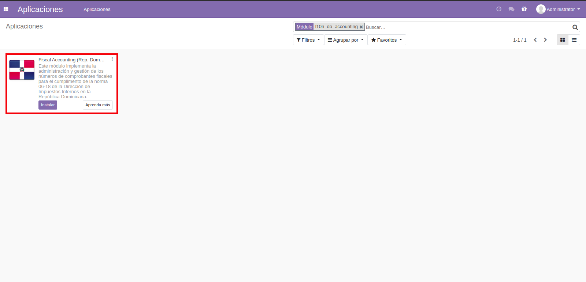
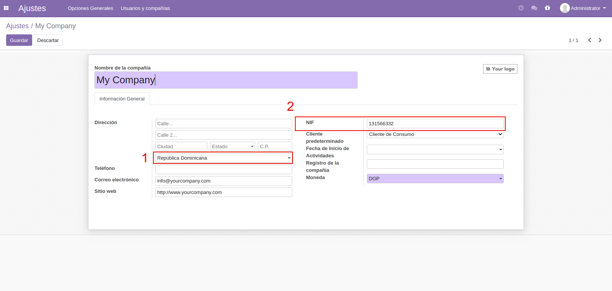

Contabilidad Fiscal
===================

 **l10n_do_accounting**: Este módulo implementa la administración y gestión de los números de
         comprobantes fiscales.

Instalación
============

Para esto, ir  **Aplicaciones** y busca **l10n_do_accounting**. Luego haga clic en **Instalar** al modulo ``l10n_do_accounting``.

Configuracion
=============

Configurar Compañía
~~~~~~~~~~~~~~~~~~~

Una vez que el módulo esté instalado, el primer paso es configurar los datos de su empresa, pais, entre otros. Además de la
información básica, un campo clave es **(RNC/NIF)**:

Catalogo de Cuentas
~~~~~~~~~~~~~~~~~~~
Catálogo de Cuentas e Impuestos para República Dominicana, Compatible para Internacionalización con NIIF y alineado a las normas y regulaciones de la Dirección General de Impuestos Internos (DGII).

      - Catálogo de Cuentas Estándar (alineado a DGII y NIIF)
      - Catálogo de Impuestos con la mayoría de Impuestos Preconfigurados
            - ITBIS para compras y ventas
            - Retenciones de ITBIS
            - Retenciones de ISR
            - Grupos de Impuestos y Retenciones:
                  - Telecomunicaiones
                  - Proveedores de Materiales de Construcción
                  - Personas Físicas Proveedoras de Servicios
            - Otros impuestos

Comprobantes Fiscales
~~~~~~~~~~~~~~~~~~~~~

En la configuracion de contabilidad selecione la opcion Diario, crear o editar el diario de ventas, 
escoja el Tipo de Diario > Ventas luego active el donde dice **Es fiscal?** luego se le generaran las secuencias de NCF.

.. image:: Media/dominicana05.PNG
   :align: center

