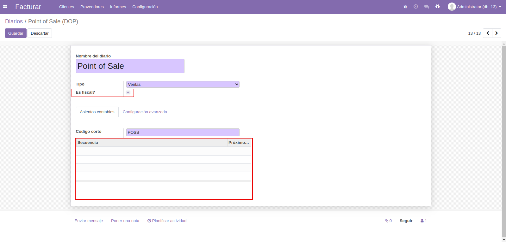
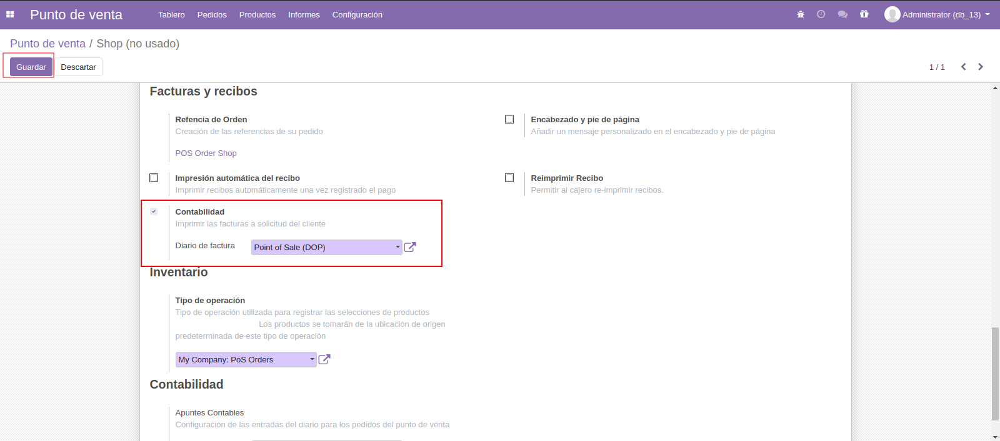
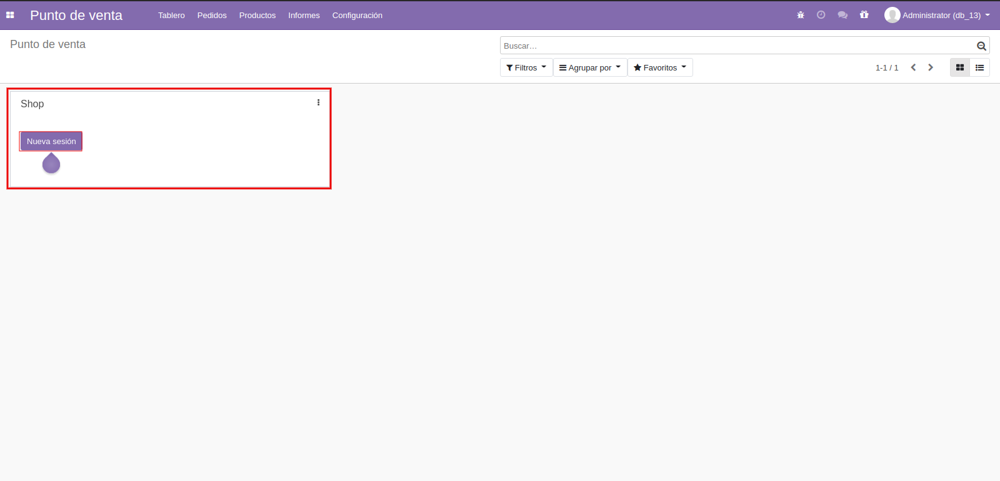
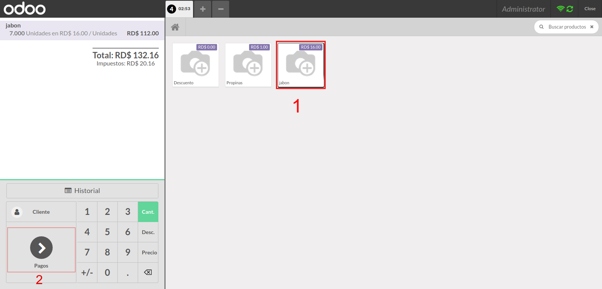
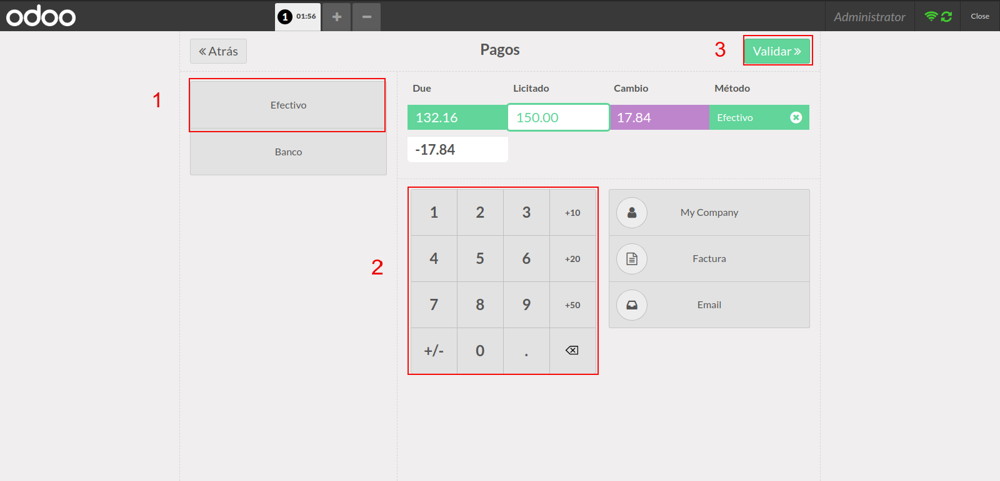

**l10n_do_pos**: Incorpora funcionalidades de facturación con NCF al punto de venta.
      
        - WIP: compatibilidad con impresoras fiscales.

Instalación
===========

Para esto, ir  **Aplicaciones** y busca **l10n_do_pos**. Luego haga clic en **Instalar** el modulo ``l10n_do_pos``.

.. image:: media/dominicana06.png
   :align: center

Configuracion
=============

Esta parte configuraremos los numeros de comprobantes fiscales para el punto de ventas.

Para esto, debemos ir a Contabilidad o Facturar > Configuracion > Diario 
Luego selecionamos el Diario del Punto de Ventas y haga click en Editar.

POS   
---

Ahora iniciaremos con la configuracion del punto de venta para poder realizar la facturación con comprobantes fiscal.

Para esto, iremos al Punto Venta > Configuracion > Puntos de Ventas Luego selecionamos el pos que queremos configurar, haga click a editar.
Vaya a la seccion Facturas y Recibos, active la opcion > Contabilidad Luego selecciona el Diario de Punto de Venta que configuramos.

Generar una factura de Consumo
~~~~~~~~~~~~~~~~~~~~~~~~~~~~~~~

1: Iniciamos sesion en nuestro pos.

2: Seleccionamos los productos y su cantidad, luego procedemos a hacer el pago.

3: Seleccionamos el método de pago, registramos el monto y validamos.

