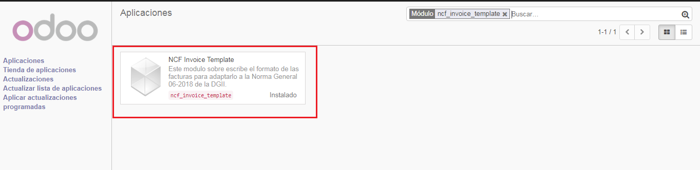

Plantilla de Facturacion
========================

 **ncf_invoice_template**: Este módulo sobre escribe el formato de las facturas para adaptarlo a la Norma General 06-2018 de la DGII.

Instalación
============

Para esto, ir  **Aplicaciones** y busca **ncf_invoice_template**. Luego haga clic en **Instalar** el modulo ``ncf_invoice_template``.

Configuracion
=============

Una vez que el modulo sea instalado esto sobre escribe el formato del reporte de facturación.

