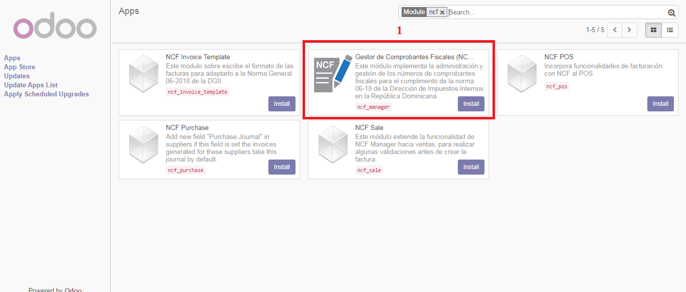
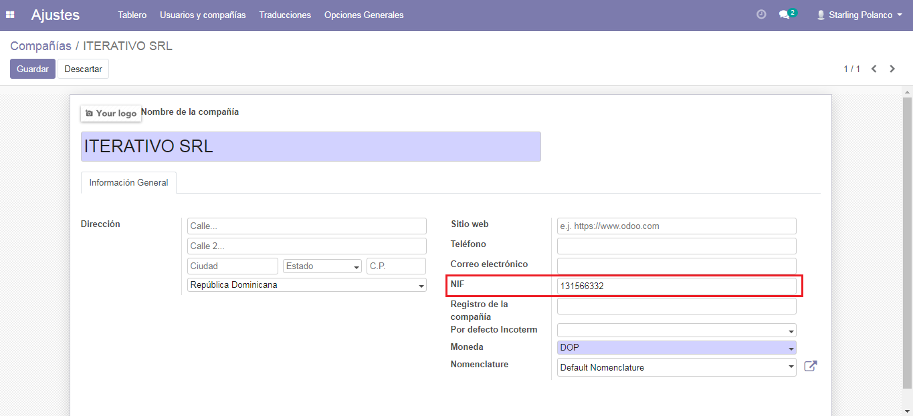
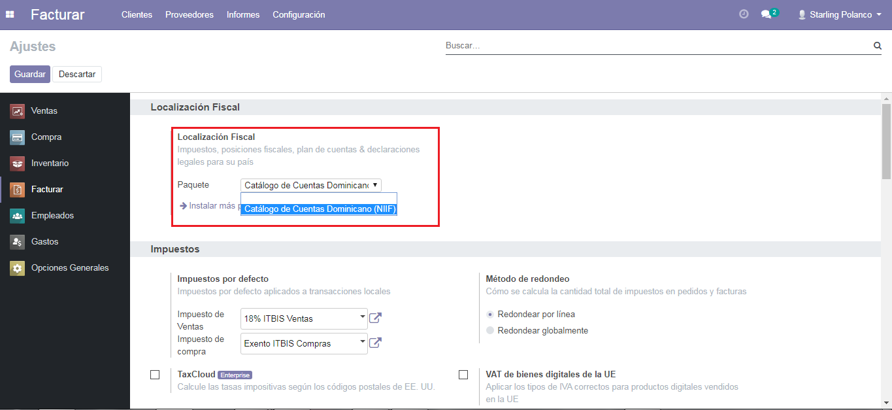
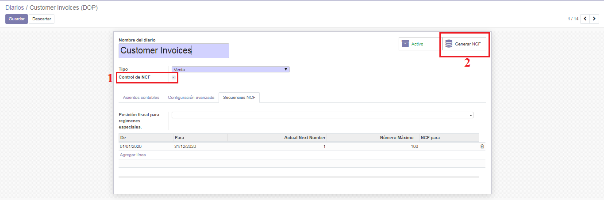
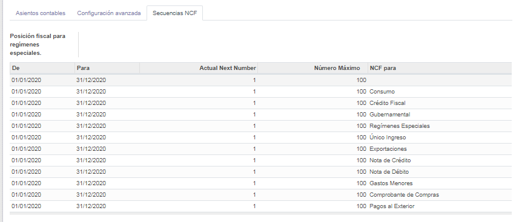

Contabilidad y Facturacion
==========================

Este repositorio consolida los módulos utilizados para poder realizar facturación en República Dominicana desde los módulos de Ventas, Compra, Contable y Punto de Ventas.

En esta versión están disponible el siguiente modulo:

- **ncf_manager**: Este módulo agrega funcionalidades para manejar numero de comprobante fiscal NCF.

        - Secuencias Preconfiguradas para manejo de todos los NCF.
        - Validación de RNC y Cédula con stdnum.
        - Validación de Estructura e-CF.
         
Instalación
=============

Para esto, ir  **Aplicaciones** y busca **ncf_manager**. Luego haga clic en **Instalar** el modulo ``ncf_manager``.

Configuracion
=============

Configurar Compañía
~~~~~~~~~~~~~~~~~~~

Una vez que los módulos están instalados, el primer paso es configurar los datos de su empresa. Además de la
información básica, un campo clave es **(RNC/NIF)**:

   

Catalogo de Cuentas
~~~~~~~~~~~~~~~~~~~
Catálogo de Cuentas e Impuestos para República Dominicana, Compatible para Internacionalización con NIIF y alineado a las normas y regulaciones de la Dirección General de Impuestos Internos (DGII).

      - Catálogo de Cuentas Estándar (alineado a DGII y NIIF)
      - Catálogo de Impuestos con la mayoría de Impuestos Preconfigurados
            - ITBIS para compras y ventas
            - Retenciones de ITBIS
            - Retenciones de ISR
            - Grupos de Impuestos y Retenciones:
                  - Telecomunicaiones
                  - Proveedores de Materiales de Construcción
                  - Personas Físicas Proveedoras de Servicios
            - Otros impuestos

En la configuración de Contabilidad desplace a la seccion **Localizacion Fiscal** vera un paquete prefoconfigurado del catalogo de cuentas dominicano que se le instalara de manera automatica, que están relacionados con el tipo de responsabilidad fiscal de la compañía.

Comprobantes Fiscales
~~~~~~~~~~~~~~~~~~~~~
En la configuracion de contabilidad selecione la opcion **Diario**, crear o editar el diario de ventas, escoja el Tipo de Diario > Ventas  luego active el **Control de NCF** luego haga click Generar NCF.

Secuencias NCF generadas.
~~~~~~~~~~~~~~~~~~~~~~~~~

